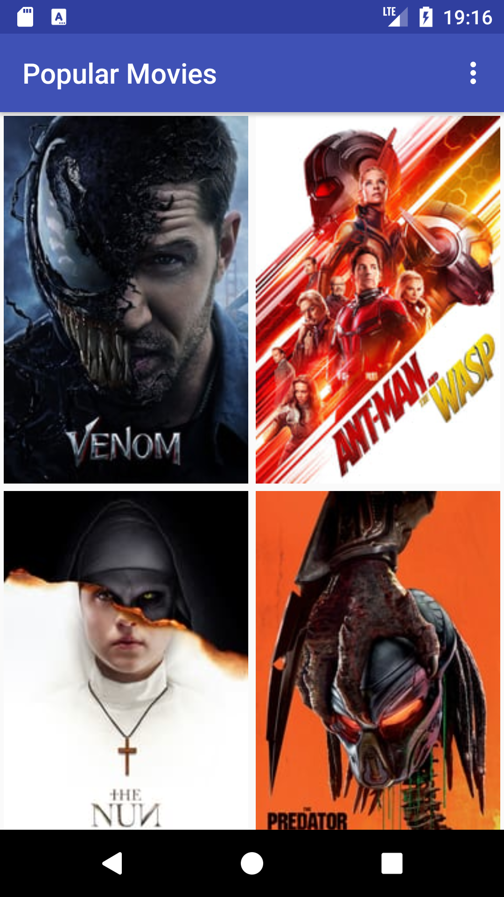
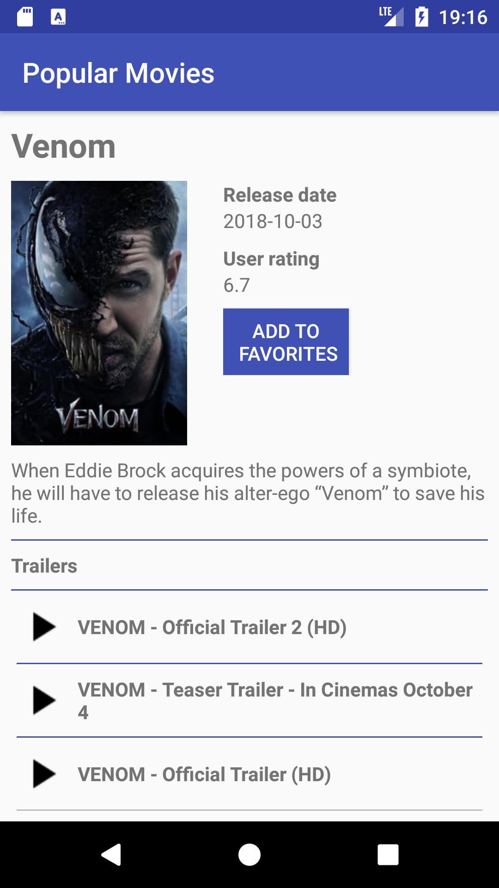
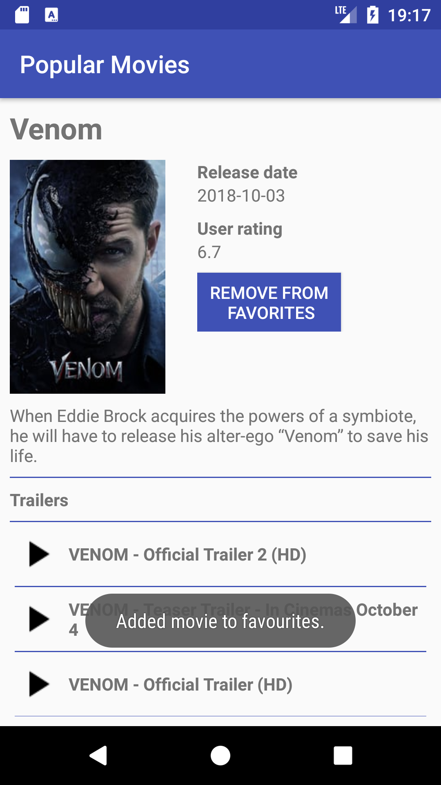

# Popular Movies App Stage 2
## Project overview
Building this app was part of the [Android Developer Nanodegree](https://eu.udacity.com/course/android-developer-nanodegree-by-google--nd801) by Udacity. The tasks for this app where:

* You’ll allow users to view and play trailers ( either in the youtube app or a web browser).
* You’ll allow users to read reviews of a selected movie.
* You’ll also allow users to mark a movie as a favorite in the details view by tapping a button(star).
* You'll create a database to store the names and ids of the user's favorite movies (and optionally, the rest of the information needed to display their favorites collection while offline).
* You’ll modify the existing sorting criteria for the main view to include an additional pivot to show their favorites collection.
* You will build a fully featured application that looks and feels natural on the latest Android operating system (Nougat, as of November 2016).

Some impression of the final project state:



## Software, libraries, and services

Build with:
* Android Studio 3.1
* JRE 1.8.0
* [Picasso](http://square.github.io/picasso/) (Loading images from the web)
* [The MovieDb API](https://www.themoviedb.org/) (Fetch information on popular movies)

For the app to work properly you need a *themoviedb* API key ([link](https://www.themoviedb.org/documentation/api)). The key has to placed in the *gradle.properties* file.
```java
API_KEY="YOUR_MOVIE_DB_API_KEY"
```
